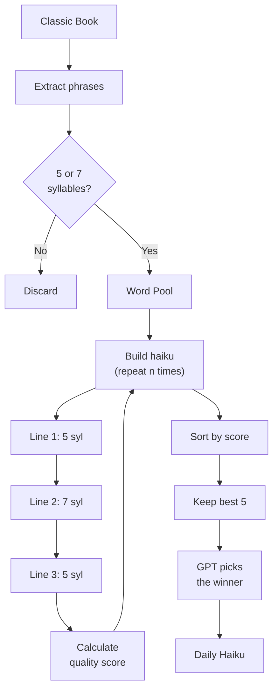

# GutenKu: When Two Frauds Make a Truth

_How I Built an AI to Expose the Beautiful Lies of "Found" Poetry_

## 🔍 The Skeptical Discovery

I discovered **Dimitri Rataud's "Haiku Marinière"** on Instagram and immediately thought: _"This is brilliant... and possibly complete bullshit."_

The concept is undeniably original - taking novels, blacking out most text with markers to "reveal" hidden haiku. The aesthetic is gorgeous, the Instagram following impressive, the gallery exhibitions successful. But watching people marvel at this "discovered poetry," I couldn't shake one question:

**Isn't this just selective editing with extra steps?**

Any text contains infinite possible word combinations. Cross out everything except "the," "moon," and "silence" from any romance novel, and you've "found" a haiku. The artistic fraud isn't in the execution - it's in calling random selection "discovery."

But here's what fascinated me: **the audience completely bought it.** People were moved by these "hidden poems." The concept worked not because it revealed anything profound about literature, but because humans are meaning-making machines who find poetry in anything aesthetically presented.

So I thought: _"If I'm going to call out this beautiful fraud, I might as well build a digital version that exposes both scams at once."_

Enter **GutenKu** - my algorithmic mirror of analog pretension.

## 🎭 Two Frauds, Same Result

### 🖌️ The Analog Fraud (Dimitri's Version):

- **The Claim:** "I reveal poetry hidden in ordinary pages"
- **The Reality:** Selective word isolation presented as literary discovery
- **The Success:** People project meaning onto curated randomness
- **The Genius:** Understanding that presentation creates perception of profundity

### 🤖 The Digital Fraud (My Version):

- **The Claim:** "AI discovers daily haiku in classic literature"
- **The Reality:** Probabilistic text recombination with aesthetic templates
- **The Success:** Same projection of meaning onto algorithmic output
- **The Mirror:** Exposing how easily we mistake process for creativity

Both are essentially **curation masquerading as creation**, but one uses black markers and the other uses machine learning.

## ⚙️ What GutenKu Actually Does (The Honest Version)

Let me be precise about what GutenKu is: **controlled combinatorial literature**, not an LLM narrative generator. There's no "understanding" of meaning here - just statistical recombination within strict constraints.

**The architecture:**

- **Closed corpus**: Only public domain texts from Project Gutenberg (Shakespeare, Austen, Dickens...)
- **Lexical selection**: Short phrases filtered by syllable count
- **Formal constraints**: Rigid 5-7-5 structure enforced mechanically
- **Markov chains**: Statistical word transitions, not semantic comprehension
- **Optional GPT curation**: AI ranking AI output (meta-fraud)

**The key insight: GutenKu doesn't promise meaning - only resonance.**

**Today's algorithmic output:**

| Perspective           | What happens                              |
| :-------------------- | :---------------------------------------- |
| **You see:**          | _"How beautiful!"_                        |
| **The machine sees:** | `random words` + `nice layout` = `poetry` |

## 🧠 The Algorithmic Deception: What's Really Happening

### The NLP & Markov Chain Stack

GutenKu uses **Markov Chains** and **NLP algorithms** - not intuition. The algorithm doesn't "understand" that "moonlight" and "silence" create atmosphere. It calculates statistical co-occurrence and scores word combinations on predetermined metrics.

_Is this discovery or just very advanced autocomplete?_

- **Sentiment Analysis:** Statistical correlation, not emotional understanding
- **Syllable Counting:** Mechanical phonetic parsing, not rhythmic intuition
- **GPT Curation:** Picks among pre-scored finalists, not raw creativity
- **Alliteration Detection:** Phonetic fingerprinting to spot repeated sounds
- **Grammar Scoring:** Part-of-speech tagging to ensure noun-verb presence
- **Verse Distance:** Preferring quotes close in the original text
- **Nature Words:** Bonus points for seasonal vocabulary (kigo-inspired)
- **Imagery Density:** Counting sensory words - colors, textures, sounds

### Technical Strengths

But here's what makes it work:

- **Poetic constraints protect the output** - the 5-7-5 structure filters noise into form
- **Noise becomes poetic** - the cut-up effect transforms random fragments into evocative juxtapositions
- **Classic texts offer rich, stable vocabulary** - Shakespeare and Austen provide lexical gold

### The Scoring Machine

Behind the apparent randomness lies a deterministic ranking system. Each haiku candidate receives a weighted score across 14 dimensions:

- **Flow scores** - Markov probability that words naturally follow each other
- **Uniqueness** - Penalizing repeated words, rewarding variety
- **Verse distance** - How close the fragments were in the original text
- **Nature presence** - Seasonal vocabulary (kigo) as quality signal
- **Grammar completeness** - Noun + verb = higher score
- **Sound patterns** - Alliteration bonus via phonetic analysis

The algorithm doesn't randomly pick - it calculates, ranks, and selects the statistically "best" candidate. GPT only intervenes at the end, choosing among the top-scored finalists. The fraud isn't chaos; it's optimization pretending to be intuition.

### Structural Limits

And what doesn't work:

- **Limited semantic coherence** - verses are scored for word overlap, but deep meaning remains accidental
- **Some outputs are grammatically correct but emotionally flat** - technically valid, humanly empty
- **Impossible to target specific intentions** - you can't ask for "a sad haiku about loss"

### The Canvas Generation Theater

Even the visuals are algorithmic: random theme selection, mathematical scaling, predetermined palettes, fixed layouts. The "artistry" is variables plugged into templates.

## 💭 The Philosophical Fraud We're All Complicit In

### The Language We Use

- We say GutenKu "craft" a new haiku → _It recombines pre-existing text_
- We say it "understands" poetry → _It recognizes statistical patterns_
- We say it "selects" the best ones → _It calculates probability scores_
- We say it "generates art" → _It fills templates with data_

### The Human Projection

When people read GutenKu's output, they bring their own:

- **Emotional experience** (the algorithm has none)
- **Cultural context** (the algorithm processes tokens, not meaning)
- **Aesthetic appreciation** (the algorithm optimizes metrics, not beauty)
- **Existential resonance** (the algorithm manipulates symbols, not concepts)

**The beautiful fraud:** We're not experiencing AI creativity - we're experiencing our own humanity projected onto algorithmic output.

### The Dimitri Rataud Contrast

**Dimitri's process:**

- Reads with lived experience → Emotional resonance → Intuitive selection → Artistic mark-making → Human meaning

**GutenKu's process:**

- Processes text data → Statistical analysis → Probability calculation → Template population → Simulated meaning

One is creation informed by consciousness. The other is simulation informed by data.

## 🔮 What Am I Actually Building?

**Hypothesis 1: Linguistic Kaleidoscope**
A pattern-generating machine that creates pleasing arrangements of words the same way a kaleidoscope creates pleasing arrangements of colored glass - beautiful, but not meaningful. Resonance without comprehension.

**Hypothesis 2: Sophisticated Plagiarism**
The darker possibility: recombining human creativity in ways statistically likely to appear original while being fundamentally derivative. Shakespeare's words, but not Shakespeare's mind.

## 💡 The Beautiful, Uncomfortable Truth

Both Dimitri's analog approach and my digital version work for the same reason: **humans are meaning-making creatures who find poetry even in well-arranged randomness.**

But here's the deeper insight: **They're working with the same raw material** - the actual words written by Shakespeare, Dickens, Austen, and other literary masters. Both approaches take humanity's greatest literature and claim to reveal its "hidden" poetry.

The success of both projects proves something fascinating about human psychology rather than about poetry discovery:

- **We want to believe great literature contains infinite wisdom** (whether in physical books or digital databases)
- **We crave narrative patterns** (5-7-5 syllable structure provides this from any source text)
- **We project meaning onto aesthetic presentation** (black markers or digital templates make the same words feel "discovered")
- **We mistake extraction methods for revelation** (manual curation or algorithmic selection from the same corpus)

**The ultimate question:** If any method can "find" poetry in Shakespeare, was the poetry already there, or are we just really good at making meaning from literary fragments?

## 🙏 My Confession as Creator

I built GutenKu to expose what I saw as the fundamental fraud in "found poetry" - but I may have created something more honest in its dishonesty. This fascination isn't new: 25 years ago, as a student inspired by Raymond Queneau's combinatorial poetry, I first explored generating haiku with Prolog (a French logic programming language rooted in AI and computational linguistics - cocorico!). The tools have changed; the fundamental question hasn't.

**GutenKu doesn't pretend to have consciousness or artistic insight.** It's transparently algorithmic, openly computational. In some ways, this makes it more honest than approaches that claim human-like discovery while really performing selection bias.

**The uncomfortable truth:** GutenKu works not because it's creative, but because we instinctively weave meaning from fragments. But isn't that exactly what makes Dimitri's approach work too?

Maybe the real discovery is this: **poetry isn't hidden in books waiting to be found - it's created in the moment when human consciousness encounters arranged words.**

---

**GutenGuess is now live - and I'm thrilled to share it!**

Can you outsmart the algorithm? [Play GutenGuess](https://gutenku.xyz/game) - a daily literary puzzle inspired by Wordle. One guess per day, same challenge for everyone. Your mission: identify which classic book inspired today's haiku. It's the ultimate test - can you recognize literature from algorithmic fragments?

---

## 🌐 Experience Both: Human and Algorithmic

**For Manual Curation:**

- Follow [@haiku_mariniere](https://www.instagram.com/haiku_mariniere/?hl=fr) for Dimitri's conscious selection
- Visit exhibitions where human aesthetic choices meet literary material

**For Algorithmic Simulation:**

- Visit [gutenku.xyz](https://gutenku.xyz) for daily computational combinations
- Follow [@gutenku.poem](https://instagram.com/gutenku.poem) for template-generated aesthetics
- Explore the [open-source code](https://github.com/heristop/gutenku) to see the fraud in action

**And finally, for honest reflection:**

- Does it matter if the process is "creative" if the result moves you?
- When we say AI "writes" haiku, are we lying to ourselves?
- Is Dimitri's manual selection fundamentally different from my algorithmic one?
- Am I reading poetry, or creating poetry in the act of reading?

## 🎪 The Final Fraud: This Article

Here's the ultimate irony: I've spent 3,000 words critiquing both approaches as fraudulent, but you probably found insights, meaning, and even beauty in this criticism.

**The fraud isn't in the algorithms or the black markers - it's in calling any curation "discovery."**

But maybe that's okay. Maybe the value isn't in authentic discovery but in creating occasions for human meaning-making. Maybe I didn't build a poet, and Dimitri didn't discover hidden poems - we both built mirrors that reflect our own consciousness back at us.

**As today's algorithmic output presents:**

> _"As the song ended / With dark and sable garments / Crowned his raven locks"_

**The question remains:** Are you reading AI poetry, human poetry, or are you reading your own humanity reflected in aesthetically arranged word combinations?

---

_The algorithm doesn't know. Dimitri's markers don't know. But you do._

_Oh, and this article? Not written with GutenKu. The cake is a lie._
