# GutenKu: When Two Frauds Make a Truth

_How I Built an AI to Expose the Beautiful Lies of "Found" Poetry_


## 🔍 The Skeptical Discovery

I discovered **Dimitri Rataud's "Haiku Marinière"** on Instagram and immediately thought: _"This is brilliant... and possibly complete bullshit."_

The concept is undeniably original - taking novels, blacking out most text with markers to "reveal" hidden haiku. The aesthetic is gorgeous, the Instagram following impressive, the gallery exhibitions successful. But watching people marvel at this "discovered poetry," I couldn't shake one question:

**Isn't this just selective editing with extra steps?**

Any text contains infinite possible word combinations. Cross out everything except "the," "moon," and "silence" from any romance novel, and you've "found" a haiku. The artistic fraud isn't in the execution - it's in calling random selection "discovery."

But here's what fascinated me: **the audience completely bought it.** People were moved by these "hidden poems." The concept worked not because it revealed anything profound about literature, but because humans are meaning-making machines who find poetry in anything aesthetically presented.

So I thought: _"If I'm going to call out this beautiful fraud, I might as well build a digital version that exposes both scams at once."_

Enter [GutenKu](https://gutenku.xyz/haiku) - my algorithmic mirror of analog pretension.

## 🎭 Two Frauds, Same Result

### 🖌️ The Analog Fraud (Dimitri's Version):


- **The Claim:** "I reveal poetry hidden in ordinary pages"
- **The Reality:** Selective word isolation presented as literary discovery
- **The Catch:** Doesn't even follow the 5-7-5 syllable rule - so not technically haiku
- **The Success:** People project meaning onto curated randomness
- **The Genius:** Understanding that presentation creates perception of profundity

### 🤖 The Digital Fraud (My Version):


- **The Claim:** "AI evolves daily haiku from classic literature"
- **The Reality:** Genetic Algorithm optimizing verse combinations with Natural Language Processing scoring
- **The Success:** Same projection of meaning onto algorithmic output
- **The Mirror:** Exposing how easily we mistake optimization for creativity

Both are essentially **curation masquerading as creation**, but one uses black markers and the other uses machine learning.

## ⚙️ What GutenKu Actually Does (The Honest Version)

Let me be precise: **GutenKu dot not use an LLM**. It doesn't "write" anything - it's a word-shuffling machine that recombines existing phrases through trial and error within strict rules.

**How it works:**

- **The library**: Only free classic books from Project Gutenberg (Shakespeare, Austen, Dickens...)
- **Phrase hunting**: Scan sentences, keep only chunks with exactly 5 or 7 syllables
- **The haiku rule**: Strict 5-7-5 structure, no exceptions
- **Evolution**: 150 haiku candidates compete and evolve over generations
- **Scoring**: 18 quality metrics + a neural network that learns what "good" means by watching evolution
- **Final polish**: GPT adds a title and translations for the winner

**The key insight: GutenKu doesn't promise meaning - only resonance.**

## 🧠 The Algorithmic Deception: What's Really Happening


GutenKu uses a **Genetic Algorithm (GA)** - think Darwin's natural selection, but for poems. The same technique engineers use to design aircraft wings. Haiku "compete" for survival based on how good they sound, and the best ones "breed" to create the next generation. _Is this artificial evolution or just brute-force search with extra steps?_

```mermaid
flowchart TD
    A["Classic Book"] --> B["Break into sentences"]
    B --> C{"5 or 7 syllables?"}
    C -->|No| X["Discard"]
    C -->|Yes| D["Verse Pools"]
    D --> E["150 random haiku"]
    E --> F["Score each one"]
    F --> G{"Good enough?"}
    G -->|No| H["Keep best → Mix → Mutate"]
    H --> F
    G -->|Yes| I["Winner!"]
```



**The biology-to-code translation:**

| Biology    | GutenKu                            |
| :--------- | :--------------------------------- |
| Individual | A complete haiku                   |
| Gene       | A single line (verse)              |
| Population | 150 competing haiku                |
| Fitness    | How "good" it scores               |
| Selection  | Pick 7 random, keep the best       |
| Crossover  | Swap verse indices between parents |
| Mutation   | Replace one verse index randomly   |

**How does it judge "quality"?** Two main techniques score each haiku:

- **NLP (Natural Language Processing)**: Checks grammar, detects nature words, measures how "poetic" words are
- **Markov chains**: A statistical trick that predicts "what word typically follows what." If "cherry" often precedes "blossom" in literature, that sequence scores higher. It's like autocomplete for poetry.

| Metric       | Plain English                                               |
| :----------- | :---------------------------------------------------------- |
| Markov Flow  | Do these words naturally follow each other?                 |
| Sentiment    | Is the emotional tone balanced (not too positive/negative)? |
| Grammar      | Does it have verbs and nouns?                               |
| Alliteration | Repeated sounds (like "silent snow")?                       |
| Imagery      | Sensory words you can see, hear, feel?                      |
| Coherence    | Do the three lines relate to each other?                    |
| Nature Words | Seasonal vocabulary (spring, moon, cherry...)?              |
| Neural Score | Does this haiku "feel" like survivors from past evolutions? |

**When does it stop?** When scores stop improving for 30 generations, or after 500 generations max, or 30 seconds - whichever comes first.

### 🧬 The Plot Twist: The Algorithm Learns From Itself

Here's where it gets weird: **GutenKu now learns from its own mistakes.**

Remember those 150 haiku competing in each generation? Some survive, most die. That's not just selection - it's **free training data**. The survivors get labeled "good," the early deaths labeled "weak."

A neural network watches this evolutionary carnage and asks: _"What do survivors have in common that the dead ones lack?"_

```
Generation 1:  150 haiku born
Generation 10: 100 remain (50 eliminated → labeled "weak")
Generation 30: Elite 5% survive (labeled "elite")

Neural network: "Aha! Elite haiku share these patterns..."
```

**What the neural network discovers:**

| What rules measure | What the network finds    |
| :----------------- | :------------------------ |
| Word overlap       | True semantic connections |
| Syllable count     | Rhythmic texture          |
| Individual metrics | How metrics interact      |

The network finds patterns too subtle for hand-coded rules. It's like the difference between knowing music theory and having an ear for what sounds good.

**The philosophical twist:** The algorithm is now learning what "good" means by watching its own evolution. It's not conscious, but it's definitely not just counting syllables anymore.

Is this still optimization theater? Absolutely. But it's optimization theater that writes its own reviews.

### Why It Works (and Doesn't)

**What works:**

- The 5-7-5 constraint forces random words into a poetic shape
- Shakespeare and Austen give us beautiful raw material
- Random combinations sometimes create surprising beauty

**What doesn't:**

- Any "deep meaning" is pure accident
- It can't write a sad haiku on purpose
- The images are just templates, not art

**The uncomfortable truth:** This isn't creativity - it's **optimization theater**. But honestly? Human poets do something similar: draft, revise, keep what sounds good. The difference? We know _why_ "moonlight" hits harder than "streetlight." The algorithm just knows one scores higher.

## 💭 The Philosophical Fraud We're All Complicit In

**Notice how we talk about it:**

| What we say             | What's actually happening                 |
| :---------------------- | :---------------------------------------- |
| GutenKu "evolves" haiku | It runs numbers until they stop improving |
| It "understands" poetry | It counts patterns in text                |
| It "creates art"        | It shuffles words until the score is high |

**Here's the twist:** When you read a GutenKu haiku and feel something, that emotion comes from _you_ - your memories, your culture, your sense of beauty. The algorithm feels nothing. **We're not experiencing AI creativity - we're experiencing our own humanity reflected back at us.**

**So what's the difference between Dimitri and GutenKu?**

- **Dimitri:** Life experience → Gut feeling → Hand-picked words → Human meaning
- **GutenKu:** Word pools → Math → High scores → Output

One is creation through consciousness. The other is optimization through metrics.

## 💡 The Beautiful, Uncomfortable Truth


Both approaches work for the same reason: **we humans are meaning-making machines.** Show us nicely arranged words, and we'll find poetry - even in randomness.

Both use the same raw material - Shakespeare, Dickens, Austen. Both claim to "reveal" hidden poetry. And both succeed because of how our brains work:

- We _want_ to believe great books contain infinite wisdom
- We love patterns (5-7-5 is satisfying, like a heartbeat)
- Pretty presentation makes anything feel profound
- We confuse "carefully selected" with "discovered"

**The big question:** If any method can "find" poetry in Shakespeare, was the poetry already there - or did we just put it there?

## 🙏 My Confession as Creator

I built GutenKu to expose the fraud in "found poetry" - and ended up creating something oddly more honest. This obsession isn't new: 2 decades ago, I was already generating haiku with Prolog (a French logic programming language), inspired by Raymond Queneau's combinatorial poetry experiments. The technology changed; the fascination didn't.

**At least GutenKu doesn't pretend to be conscious.** It's openly algorithmic. In a weird way, that's more honest than claiming to "discover" hidden poems while cherry-picking words.

**What I actually learned:** Poetry isn't hiding in books, waiting to be found. It's born the moment a human mind encounters arranged words and decides to feel something.

---

## 🌐 Try Both Approaches


**The human way:**

- Follow [@haiku_mariniere](https://www.instagram.com/haiku_mariniere/?hl=fr) for Dimitri's hand-picked poetry
- Visit his exhibitions to see the physical art

**The algorithmic way:**

- Visit [gutenku.xyz](https://gutenku.xyz) for daily computer-generated haiku
- Follow [@gutenku.poem](https://instagram.com/gutenku.poem) on Instagram
- Peek at the [source code](https://github.com/heristop/gutenku) to see how the sausage is made

**Questions to sit with:**

- Does it matter _how_ poetry is made if it moves you?
- When we say AI "writes," are we kidding ourselves?
- Is hand-picking words really that different from algorithmic selection?
- Are you reading poetry, or creating it by reading?

## 🎪 The Final Fraud: This Article

Here's the ultimate irony: I just spent 2,000+ words calling both approaches fraudulent - and you probably found insights, meaning, maybe even a little beauty in the criticism.

**The fraud isn't in the algorithms or the black markers. It's in calling any curation "discovery."**

But maybe that's fine? Maybe the point was never "authentic discovery" but creating excuses for humans to make meaning. Maybe I didn't build a poet, and Dimitri didn't find hidden poems - we both just built mirrors.

**Today's algorithm produced this:**


> _"As the song ended / With dark and sable garments / Crowned his raven locks"_

**So tell me:** Are you reading AI poetry, human poetry, or your own humanity reflected in nicely arranged words?

---

_The algorithm doesn't know. Dimitri's markers don't know. But you do._

_P.S. This article? Not written with GutenKu. The cake is a lie._
