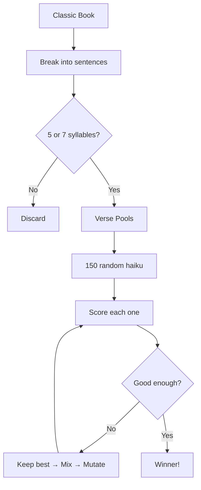
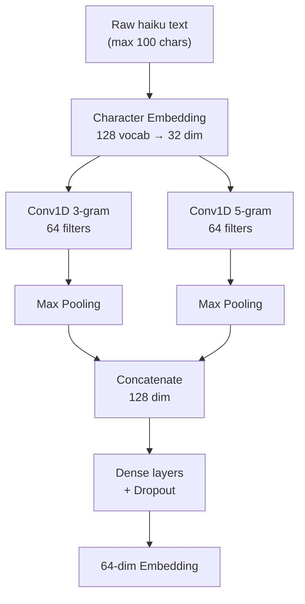

# GutenKu Technical Deep-Dive

_The Algorithm Behind the Poetry Machine_

## Context

This article is the technical companion to [GutenKu: When Two Frauds Make a Truth](/blog/gutenku-when-two-frauds-make-a-truth), which explores the philosophy and artistic context of algorithmic poetry. Here, we get our hands dirty with the implementation.

---

## How It All Fits Together

Imagine a meat grinder, but for literature. You feed in a classic novel, and out comes... haiku? Sort of. Here's the journey:

**First**, we chop up a book from [Project Gutenberg](https://www.gutenberg.org/) into individual phrases and keep only those with exactly 5 or 7 syllables. This gives us two "pools" of raw material - one for short lines, one for long.

**Then**, 150 random haiku are assembled from these pools and thrown into an evolutionary arena. They compete, breed, mutate. The survivors pass their "genes" (which verses they use) to the next generation.

**Finally**, a neural network trained on thousands of previous evolutionary runs gives its verdict, and GPT adds the finishing touches - a title, translations, and an AI-generated image in traditional Japanese art styles.

---

## The Genetic Algorithm

Evolution isn't just for finches. The same optimization technique that designs aircraft wings and optimizes delivery routes can also breed poetry.

### Survival of the Fittest (Haiku)

A population of 150 haiku candidates competes each generation. The top 6 elite survivors pass directly to the next round - unchanged, like royalty. The rest fight for their place through tournament selection: pick 7 random haiku, keep the winner. Repeat until you have enough parents.

Then the fun part: breeding. Two parent haiku swap their verses with a 90% crossover rate - maybe the first line from mom, the rest from dad. And because evolution needs chaos, each verse has a 12% chance of mutating into something completely different from the pool.

Here's how biology maps to code:

| Biology        | In GutenKu                                 |
| :------------- | :----------------------------------------- |
| **Individual** | A complete haiku (three verse indices)     |
| **Gene**       | A single verse index pointing to the pool  |
| **Fitness**    | Quality score from 18 metrics              |
| **Selection**  | Tournament: 7 random candidates, best wins |
| **Crossover**  | Swap verses between two parents            |
| **Mutation**   | Random verse replacement                   |

The algorithm stops when improvement stagnates (less than 0.5% gain over 30 generations), or when it hits the 30-second timeout. Most runs converge somewhere between 80-150 generations.

---

## The Scoring System

How do you teach an algorithm what makes a haiku "good"? You break down the ineffable into 18 measurable signals.

### What the Algorithm Looks For

| Category      | Key Metrics                                                                                            |
| :------------ | :----------------------------------------------------------------------------------------------------- |
| **Penalties** | Repeated words (-2), weak starts like "it" or "there" (-2), special characters (-3), proper nouns (-2) |
| **Language**  | Markov flow (do words naturally follow each other?), grammar structure, verb presence                  |
| **Poetry**    | Nature words (+2 each), alliteration, sensory imagery density                                          |
| **Structure** | Verse distance, line balance, semantic coherence                                                       |

### The Surprising Metrics

**Verse distance** carries the highest weight, and it's the most counterintuitive. Haiku whose lines came from nearby passages in the original book score higher than those assembled from random corners. Why? Proximity in the source text means the author was thinking along a thread - the lines carry echoes of a single train of thought.

**Markov flow** asks a simple question: would these words appear together naturally? The algorithm trains bigram probabilities on the full corpus of fetched Gutenberg books - learning what word sequences each author tends to use. "Cherry blossom" scores high. "Cherry algorithm" does not.

$$P(\text{"blossom"} \mid \text{"cherry"}) = 0.73$$ → Words that belong together

$$P(\text{"algorithm"} \mid \text{"cherry"}) = 0.001$$ → Word salad

**Nature words** get a direct bonus. Moon, shadow, mist, cherry - the vocabulary of traditional haiku. This is the most blunt metric: just count them.

The final score typically lands somewhere between -5 and +15, though most decent haiku cluster around 5-10.

---

## The Neural Network Layer

Here's where it gets interesting: **GutenKu learns from its own evolutionary process**.

### Learning from Survival

Every evolutionary run generates free training data. Haiku that survive to the final generation get labeled "elite." Haiku eliminated early get labeled "weak." No human annotation required - evolution itself becomes the teacher.

### Reading Character by Character

Unlike most NLP (Natural Language Processing) systems that work with words, GutenKu's neural network reads haiku character by character. Why? Rhythm, spacing, letter patterns - the subtle music of language lives below the word level.

The two parallel convolution paths catch different rhythms: 3-character patterns (word endings, prefixes) and 5-character patterns (phrase-level flows).

### Teaching by Comparison

Training works like teaching a dog the difference between "good boy" and "bad boy" - not through abstract rules, but through examples.

The network sees triplets: one elite haiku (the anchor), another elite (the positive example), and one early elimination (the negative). Its job is to learn what makes the two survivors similar to each other, and different from the loser.

$$\mathcal{L} = \max(d(A, P) - d(A, N) + \text{margin}, 0)$$

Over thousands of triplets, patterns emerge. The network develops an intuition for "survivor-ness" that the rule-based scoring can't capture.

### The Hybrid Score

After training, the network builds an "elite centroid" - the mathematical average of all survivors. New haiku are scored by how similar they are to this ideal point.

The final fitness blends both approaches:

$$F_{total} = 0.6 \times S_{rules} + 0.4 \times S_{network}$$

The rules catch obvious problems; the network perceives the subtleties hidden behind the words.

---

## Under the Hood

The backend runs on Node.js with a GraphQL API. The NLP magic comes from the [natural](https://naturalnode.github.io/natural/) library - sentiment analysis, POS tagging, and Metaphone phonetics for alliteration detection. The genetic algorithm and Markov chain across verses are fully custom. TensorFlow.js powers the neural network. MongoDB stores books, chapters, and haiku history.

For the "haiku of the day" feature, a seeded random number generator ensures everyone sees the same poem each day - deterministic evolution from a shared seed.

GPT handles the finishing touches that algorithms struggle with: picking the best haiku from the top 5 candidates, writing creative titles, generating translations in five languages, and creating artistic backgrounds via gpt-image in traditional Japanese styles (nihonga, sumi-e, ukiyo-e).

The [source code is open](https://github.com/heristop/gutenku) if you want to dig deeper.

---

## What This Reveals

GutenKu doesn't promise meaning - only resonance. The algorithm optimizes for patterns that historically "survive" the evolutionary process, which correlates loosely with what humans find aesthetically pleasing.

**The uncomfortable truth**: When a haiku moves you, that emotion comes from _you_ - your memories, your cultural context, your sense of beauty. The algorithm feels nothing.

We're not experiencing AI creativity. We're experiencing our own humanity reflected back at us through nicely arranged words.

---

_For the philosophical context behind this technical machinery, read [GutenKu: When Two Frauds Make a Truth](/blog/gutenku-when-two-frauds-make-a-truth)._

<small>Illustration credits: [@heristop](https://instagram.com/heristop)</small>
