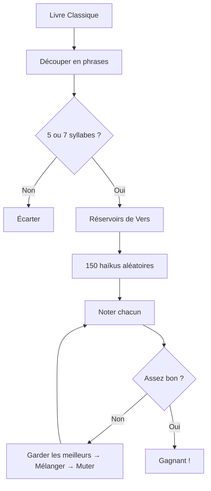
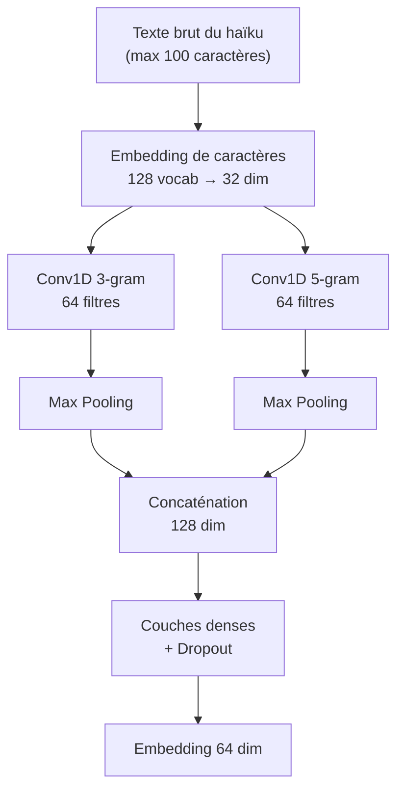

# GutenKu : L'Envers du Décor

_L'Algorithme Derrière la Machine à Poésie_

## Contexte

Cet article constitue le volet technique de [GutenKu : Quand Deux Impostures Font une Vérité](/blog/gutenku-when-two-frauds-make-a-truth), qui explore la philosophie et le contexte artistique de la poésie algorithmique. Ici, nous mettons les mains dans le cambouis.

---

## Vue d'Ensemble

Imaginez un hachoir à viande, mais pour la littérature. Vous y introduisez un roman classique, et il en sort... des haïkus ? En quelque sorte. Voici le parcours :

**Premièrement**, nous découpons un livre de Project Gutenberg en phrases individuelles et ne gardons que celles ayant exactement 5 ou 7 syllabes. Cela nous donne deux « réservoirs » de matière première - un pour les vers courts, un pour les longs.

**Ensuite**, 150 haïkus aléatoires sont assemblés à partir de ces réservoirs et lancés dans une arène évolutive. Ils s'affrontent, se reproduisent, mutent. Les survivants transmettent leurs « gènes » (quels vers ils utilisent) à la génération suivante.

**Enfin**, un réseau de neurones entraîné sur des milliers d'exécutions évolutives précédentes donne son verdict, et GPT ajoute les touches finales - un titre, des traductions, et une image générée par IA dans les styles artistiques japonais traditionnels.

---

## L'Algorithme Génétique

Darwin aurait approuvé. La même technique d'optimisation qui conçoit les ailes d'avion et optimise les itinéraires de livraison peut aussi faire évoluer la poésie.

### La Survie du Plus Apte (Haïku)

Une population de 150 candidats haïkus s'affronte à chaque génération. Les 6 meilleurs survivants d'élite passent directement au tour suivant - inchangés, comme la royauté. Les autres luttent pour leur place par sélection de tournoi : choisir 7 haïkus au hasard, garder le gagnant. Répéter jusqu'à avoir assez de parents.

Puis la partie amusante : la reproduction. Deux haïkus parents échangent leurs vers avec un taux de croisement de 90% - peut-être la première ligne de la mère, le reste du père. Et parce que l'évolution a besoin de chaos, chaque vers a 12% de chance de muter en quelque chose de complètement différent du réservoir.

Voici comment la biologie se transpose en code :

| Biologie       | Dans GutenKu                                        |
| :------------- | :-------------------------------------------------- |
| **Individu**   | Un haïku complet (trois indices de vers)            |
| **Gène**       | Un seul indice de vers pointant vers le réservoir   |
| **Fitness**    | Score de qualité issu de 18 métriques               |
| **Sélection**  | Tournoi : 7 candidats aléatoires, le meilleur gagne |
| **Croisement** | Échange de vers entre deux parents                  |
| **Mutation**   | Remplacement aléatoire de vers                      |

L'algorithme s'arrête quand l'amélioration stagne (moins de 0,5% de gain sur 30 générations), ou quand il atteint le timeout de 30 secondes. La plupart des exécutions convergent entre 80 et 150 générations.

---

## Le Système de Notation

Comment enseigner à un algorithme ce qui fait un « bon » haïku ? Vous décomposez l'ineffable en 18 signaux mesurables.

### Ce Que l'Algorithme Recherche

| Catégorie     | Métriques Clés                                                                                                |
| :------------ | :------------------------------------------------------------------------------------------------------------ |
| **Pénalités** | Mots répétés (-2), débuts faibles comme « il » ou « c'est » (-2), caractères spéciaux (-3), noms propres (-2) |
| **Langage**   | Chaîne de Markov (les mots se suivent-ils naturellement ?), structure grammaticale, présence de verbes        |
| **Poésie**    | Mots de la nature (+2 chacun), allitération, densité d'imagerie sensorielle                                   |
| **Structure** | Distance des vers, équilibre des lignes, cohérence sémantique                                                 |

### Les Métriques Surprenantes

**La distance des vers** a le poids le plus élevé, et c'est la plus contre-intuitive. Les haïkus dont les lignes proviennent de passages proches dans le livre original obtiennent un meilleur score que ceux assemblés à partir de passages aléatoires. Pourquoi ? La proximité dans le texte source signifie que l'auteur réfléchissait sur un fil conducteur - les lignes portent les échos d'un seul train de pensée.

**La chaîne de Markov** pose une question simple : ces mots apparaîtraient-ils naturellement ensemble ? L'algorithme calcule les probabilités de bigrammes sur l'ensemble du corpus de livres Gutenberg récupérés - apprenant quelles séquences de mots chaque auteur tend à utiliser. « Fleur de cerisier » obtient un score élevé. « Cerisier algorithme » non.

$$P(\text{"fleur"} \mid \text{"cerisier"}) = 0.73$$ → Mots qui vont ensemble

$$P(\text{"algorithme"} \mid \text{"cerisier"}) = 0.001$$ → Salade de mots

**Les mots de la nature** obtiennent un bonus direct. Lune, ombre, brume, cerisier - le vocabulaire du haïku traditionnel. C'est la métrique la plus directe : il suffit juste de compter les occurrences.

Le score final se situe généralement entre -5 et +15, bien que la plupart des haïkus corrects se regroupent autour de 5-10.

---

## La Couche de Réseau de Neurones

C'est là que ça devient intéressant : **GutenKu apprend de son propre processus évolutif**.

### Apprendre de la Survie

Chaque exécution évolutive génère des données d'entraînement gratuites. Les haïkus qui survivent jusqu'à la génération finale sont étiquetés « élite ». Les haïkus éliminés tôt sont étiquetés « faibles ». Aucune annotation humaine requise - l'évolution elle-même devient le professeur.

### Lire Caractère par Caractère

Contrairement à la plupart des systèmes NLP (Natural Language Processing) qui travaillent avec des mots, le réseau de neurones de GutenKu lit les haïkus caractère par caractère. Pourquoi ? Le rythme, l'espacement, les motifs de lettres - la musique subtile du langage vit en dessous du niveau des mots.

Les deux chemins de convolution parallèles captent des rythmes différents : les motifs de 3 caractères (terminaisons de mots, préfixes) et les motifs de 5 caractères (flux au niveau des phrases).

### Enseigner par Comparaison

L'entraînement fonctionne comme apprendre à un chien la différence entre « bon chien » et « mauvais chien » - non pas par des règles abstraites, mais par des exemples.

Le réseau voit des triplets : un haïku d'élite (l'ancre), un autre élite (l'exemple positif), et un éliminé précocement (le négatif). Son travail est d'apprendre ce qui rend les deux survivants similaires entre eux, et différents du perdant.

$$\mathcal{L} = \max(d(A, P) - d(A, N) + \text{marge}, 0)$$

Sur des milliers de triplets, des motifs émergent. Le réseau développe une intuition de « capacité de survie » que la notation basée sur les règles ne peut pas capturer.

### Le Score Hybride

Après l'entraînement, le réseau construit un « centroïde d'élite » - la moyenne mathématique de tous les survivants. Les nouveaux haïkus sont notés selon leur similarité avec ce point idéal.

Le fitness final mélange les deux approches :

$$F_{total} = 0.6 \times S_{\text{règles}} + 0.4 \times S_{\text{réseau}}$$

Les règles détectent les problèmes évidents ; le réseau perçoit les subtilités cachées derrière les mots.

---

## Sous le Capot

Le backend tourne sur Node.js avec une API GraphQL. La magie NLP vient de la bibliothèque [natural](https://naturalnode.github.io/natural/) - analyse de sentiment, étiquetage POS, et phonétique Metaphone pour la détection d'allitération. L'algo génétique et la chaîne de Markov à travers les vers sont full custom. TensorFlow.js alimente le réseau de neurones. MongoDB stocke les livres, chapitres et l'historique des haïkus.

Pour le « haïku du jour », une graine partagée garantit que tout le monde voit le même poème chaque jour — l'évolution reste déterministe.

GPT gère les touches finales avec lesquelles les algorithmes ont du mal : choisir le meilleur haïku parmi les 5 meilleurs candidats, écrire des titres créatifs, générer des traductions en cinq langues, et créer des fonds artistiques via gpt-image dans les styles japonais traditionnels (nihonga, sumi-e, ukiyo-e).

Le [code est open source](https://github.com/heristop/gutenku) pour les curieux.

---

## Ce Que Cela Révèle

GutenKu ne promet pas d'apporter du sens - seulement de la résonance. L'algorithme optimise pour des motifs qui historiquement « survivent » au processus évolutif, ce qui correspond vaguement avec ce que les humains trouvent esthétiquement plaisant.

**La vérité inconfortable** : Quand un haïku vous émeut, cette émotion vient de _vous_ - vos souvenirs, votre contexte culturel, votre sens de la beauté. L'algorithme ne ressent rien.

Ce n'est pas la créativité de l'IA que nous percevons. C'est notre propre humanité qui nous est renvoyée à travers des mots joliment arrangés.

---

_Pour le contexte philosophique derrière cette machinerie technique, lisez [GutenKu : Quand Deux Impostures Font une Vérité](/blog/gutenku-when-two-frauds-make-a-truth)._
